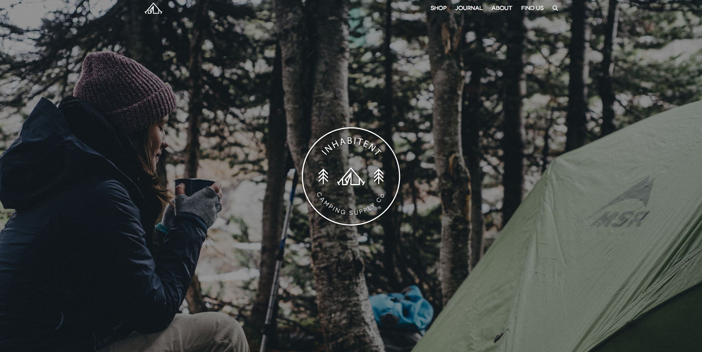
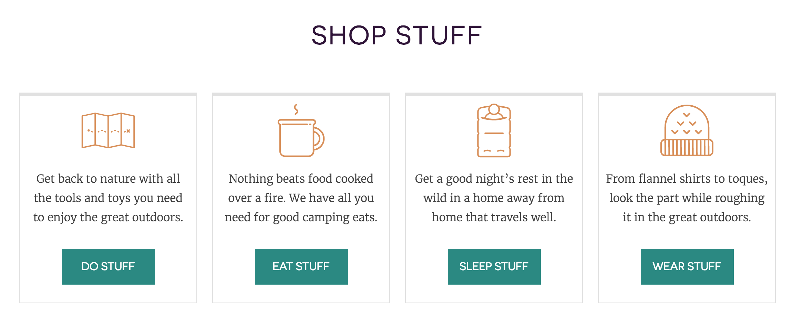
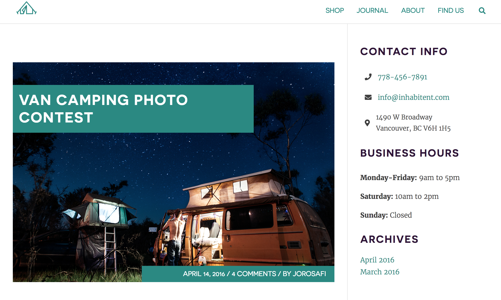
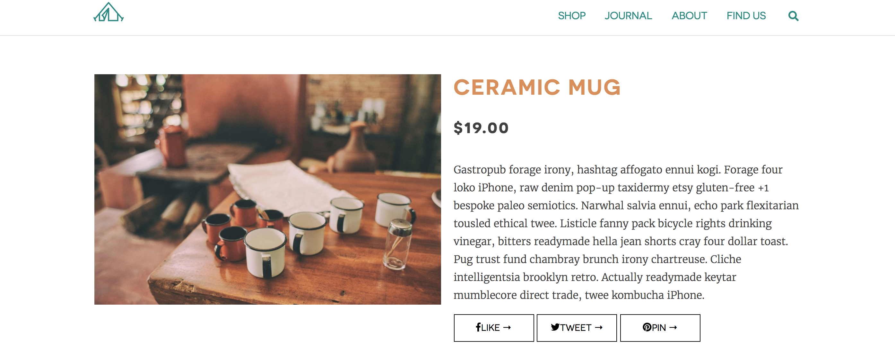
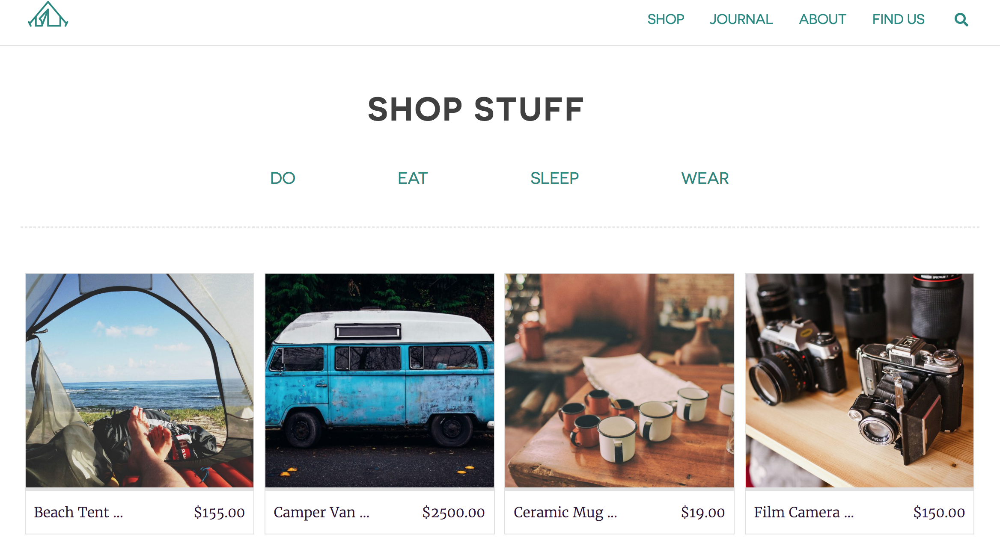

# Inhabitent

This is my very first Wordpress custom theme!

It is a simple ecommerce website template without the functionality. In this project I learned:
  
  * How Wordpress uses template files and template parts to build a website
  * How to build a custom theme using the Underscore starter files
  * How to create custom functionalities for a Wordpress site
  * How to build custom plugins
  * How to enqueue style sheets and scripts
  * How to create custom post/page types as well as custom taxonomies to organize a website
  * And much more

## Page Types
One of the biggest difficulties I had building this theme was the large number of custom pages that I had to create and stylize. These are some of the pages I built as part of this theme:

### Front Page

The front page, which is built on the fron-page.php file, consists of a hero banner and an index of the different page types found in the website: products, regular blog posts and adventure posts. The hardest part to build for this was the products section as that required a custom taxonomy to categorize the products into Do, Eat, Sleep and Wear. The other two sections required a simple query loop to retrieve the posts. 

### About Page

The about page uses the about.php template file along with the Custom Fiels Suite plugin to generate the hero image and content. The CFS suite helps separate the Our Story and Our Team sections in the back-end WYSIWYG to ensure any changes in content maintain the same style in the front-end. The client is also able to change the hero image using the CFS plugin. 

### Regular Blog Posts

The layout for the regular blog posts, which are called Journal on the website, is used for all pages that use a sidebar. Some of the styling changes from page to page, but the overall layout remains the same. The blog post layout is built on the single.php file, while the archive for the posts is built on home.php. 

### Product Pages

The product pages are a custom post type generated using the GenerateWP web tool (https://generatewp.com/post-type/). The layout for these pages is built in the single-product.php template file. 

These pages also have their own taxonomy, which was also built using GenerateWP (https://generatewp.com/taxonomy/). This custom taxonomy is used to classify the products into sections and display them on the front page and product archive. 

### Adventure posts

Finally, the adventure posts are custom post types (also generated with GenerateWP) that act as a different type of blog post. These use the same basic components as the regular blog posts, but the layout is different. The layout for these can be found at single-adventure_post_type.php. 

## Installation
To install this theme locally and make edits, follow these instructions:

### 1. Download me (don't clone me!)

Then add me to your `wp-content` directory.

### 2. Rename the `redstarter-master` directory

Make sure that the theme directory name is project appropriate!

### 3. Install the dev dependencies

Next you'll need to run `npm install` **inside your theme directory** next to install the node modules you'll need for Gulp, etc.

### 4. Update the proxy in `gulpfile.js`

Lastly, be sure to update your `gulpfile.js` with the appropriate URL for the Browsersync proxy (so change `localhost[:port-here]/[your-dir-name-here]` to the appropriate localhost URL).
